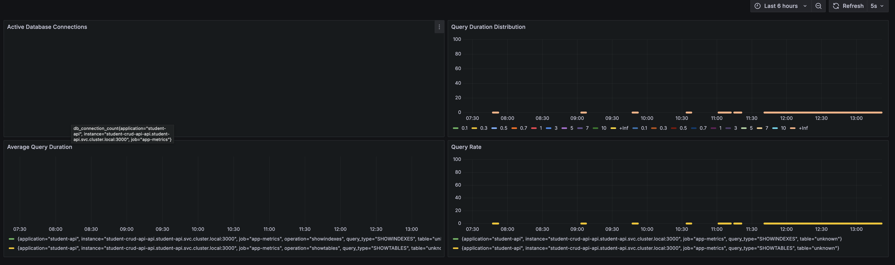
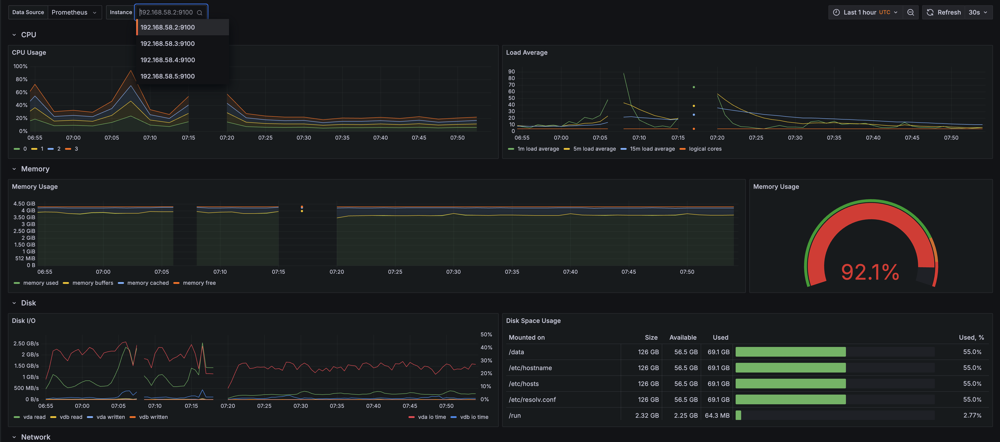
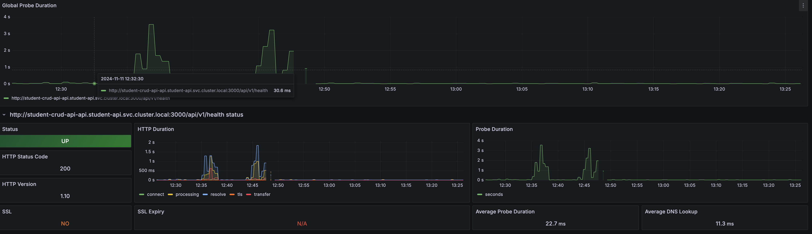
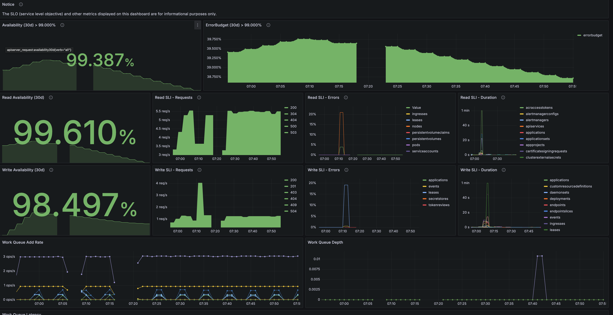

# Observability Stack Setup Guide

This guide explains how to set up and configure a comprehensive observability stack in a Kubernetes environment.

## Prerequisites

- Kubernetes cluster (v1.16+)
- Helm v3.0+
- `kubectl` configured to communicate with your cluster
- A Kubernetes namespace for monitoring components

## Components

The stack consists of two main parts:

### 1. kube-prometheus-stack
- Prometheus (metrics collection and storage)
- Grafana (visualization and alerting)
- Prometheus Operator (for managing monitoring configurations)
- AlertManager (for Kubernetes system alerts)
- Built-in dashboards for Kubernetes monitoring

### 2. loki-stack
- Loki (log aggregation)
- Promtail (log collection agent)

### 3. prometheus-blackbox-exporter
- External endpoint monitoring
- HTTP probe checks

## Installation

### 1. Create Namespace

```bash
kubectl create namespace monitoring
```

### 2. Deploy the Stack

From the root directory of your project:

```bash
helm upgrade --install observability charts/monitoring -f values.yaml -n monitoring
```

## Configuration Details

### Node Placement

The stack is configured to run on nodes with specific labels:

```yaml
nodeSelector:
  type: dependent_services
```

Ensure your cluster has nodes labeled appropriately:

```bash
kubectl label nodes <node-name> type=dependent_services
```

### Component Configurations

#### Loki Stack
- Version: 2.9.3
- Configured with readiness and liveness probes (45s initial delay)
- HTTP metrics port: 3100
- Promtail configured to collect logs from all application pods

#### kube-prometheus-stack
- Complete Kubernetes monitoring solution
- Grafana configured for:
  - Metrics visualization
  - Alert configuration and management
  - Slack notifications for application alerts
- AlertManager configured for Kubernetes system alerts
- Prometheus configured with custom scrape configs for:
  - Static monitoring (health checks via Blackbox Exporter)
  - Application metrics

#### Monitoring Targets

The stack is preconfigured to monitor:
1. Service health checks:
   - `student-crud-api-api.student-api.svc.cluster.local:3000/api/v1/health`
2. Application metrics:
   - `student-crud-api-api.student-api.svc.cluster.local:3000/metrics`

### Accessing Services

After deployment, the following services will be available:

1. Grafana:
```bash
kubectl port-forward svc/observability-grafana 3000:80 -n monitoring
```
Access at: `http://localhost:3000`

2. Prometheus:
```bash
kubectl port-forward svc/observability-kube-prometheus-stack-prometheus 9090:9090 -n monitoring
```
Access at: `http://localhost:9090`

3. Loki Query Interface:
```bash
kubectl port-forward svc/observability-loki 3100:3100 -n monitoring
```
Access at: `http://localhost:3100`

## Alert Configuration

### Grafana Alerts
1. Configure alerts through Grafana UI for application monitoring
2. Set up Slack notifications:
   - Navigate to Alerting → Contact points
   - Add Slack as a contact point
   - Configure Slack webhook URL
   - Test the connection

### Kubernetes System Alerts
- Managed by AlertManager from kube-prometheus-stack
- Pre-configured alerts for Kubernetes components
- Can be viewed in AlertManager UI

## Dashboards and Alerts Screenshots

**DB metrics dashboard:**


**Node Metrics Dashboard:**


**Blackbox metrics dashboard:**


**Kube-state metrics dashboard:**


## Verification

Verify the installation by checking the pod status:

```bash
kubectl get pods -n monitoring
```

All pods should be in `Running` state with status `1/1` or `2/2` depending on the component.

## Troubleshooting

1. If pods are not scheduling:
   - Verify node labels: `kubectl get nodes --show-labels`
   - Check tolerations match your node taints

2. If metrics are not appearing:
   - Verify service endpoints: `kubectl get endpoints -n monitoring`
   - Check Prometheus targets in the UI for scrape errors

3. If logs are not appearing in Loki:
   - Verify Promtail pods are running on all nodes
   - Check Promtail logs: `kubectl logs -l app=promtail -n monitoring`

4. If alerts are not being sent to Slack:
   - Verify Slack webhook configuration in Grafana
   - Check Grafana alert configuration
   - Test alert notification channel

## Maintenance

Regular maintenance tasks:

1. Monitor disk usage of Prometheus and Loki
2. Review and adjust retention periods if needed
3. Keep track of version updates for security patches
4. Regularly review alert configurations and thresholds

For additional configuration options, refer to the official documentation of each component.