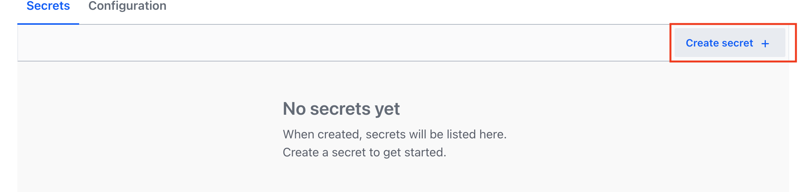
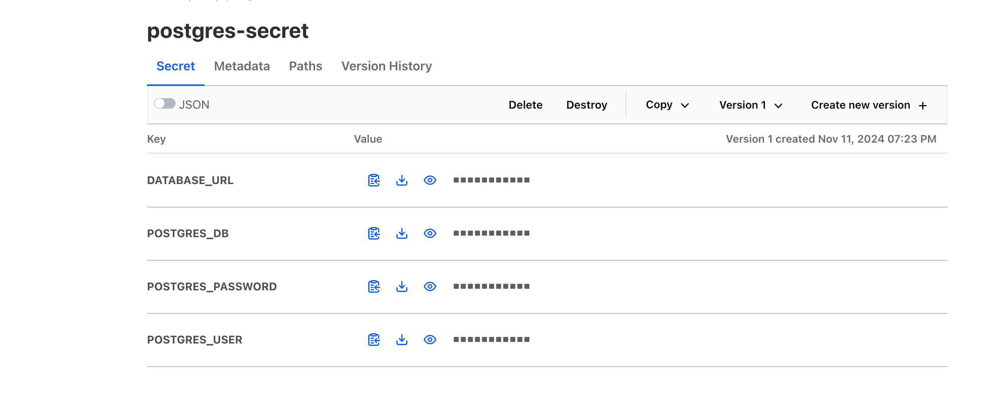

# HashiCorp Vault Setup Guide

Quick guide for setting up HashiCorp Vault in Kubernetes using Helm.

## Installation

1. Install Vault using Helm:
```bash
helm upgrade --install vault-setup charts/vault --namespace vault --create-namespace
```

2. Initialize Vault to generate keys:
```bash
kubectl exec vault-setup-0 -n vault -- vault operator init \
    -key-shares=3 \
    -key-threshold=3 \
    -format=json > keys.json
```

## Visual Setup Guide

### 1. Initial Key Generation


After initialization, Vault generates unseal keys and root token. **Keep these secure!**

### 2. Unsealing Process

- Vault starts in a sealed state
- Requires key portions for unsealing
- Progress tracker shows keys provided (e.g., 2/3 keys)

### 3. Vault UI - Secrets Management

- Access the UI at `localhost:8200`
- Navigate to Secrets Engines section
- Manage different types of secrets

## Secrets Management
### Create the kv secrets engine

After the Vault setup is complete, you can create the `postgres-secret` using the Vault CLI or the Vault UI.

Using the Vault CLI:
```bash
# Enable the kv secrets engine
kubectl exec vault-setup-0 -n vault -- vault secrets enable kv

### Write the postgres-secret
kubectl exec vault-setup-0 -n vault -- vault kv put kv/postgres-secret \
    DATABASE_URL=<your-database-url> \
    POSTGRES_DB=<your-postgres-db> \
    POSTGRES_USER=<your-postgres-user> \
    POSTGRES_PASSWORD=<your-postgres-password>
```

Using the Vault UI:

Access the Vault UI at localhost:8200.
In the Secrets Engines section, enable a new KV secrets engine.



Navigate to the KV secrets engine and create a new secret called postgres-secret.
Add the following keys and their respective values:

* DATABASE_URL
* POSTGRES_DB
* POSTGRES_USER
* POSTGRES_PASSWORD



## Security Notes

- Store unseal keys securely
- Distribute keys to different team members
- Never store keys in version control
- Backup keys and root token safely

## Quick Verification

Check Vault status:
```bash
kubectl exec vault-setup-0 -n vault -- vault status
```

## Troubleshooting

If pods aren't starting:
```bash
kubectl describe pod vault-setup-0 -n vault
kubectl logs vault-setup-0 -n vault
```

For detailed configuration and advanced setup, refer to HashiCorp's official documentation.